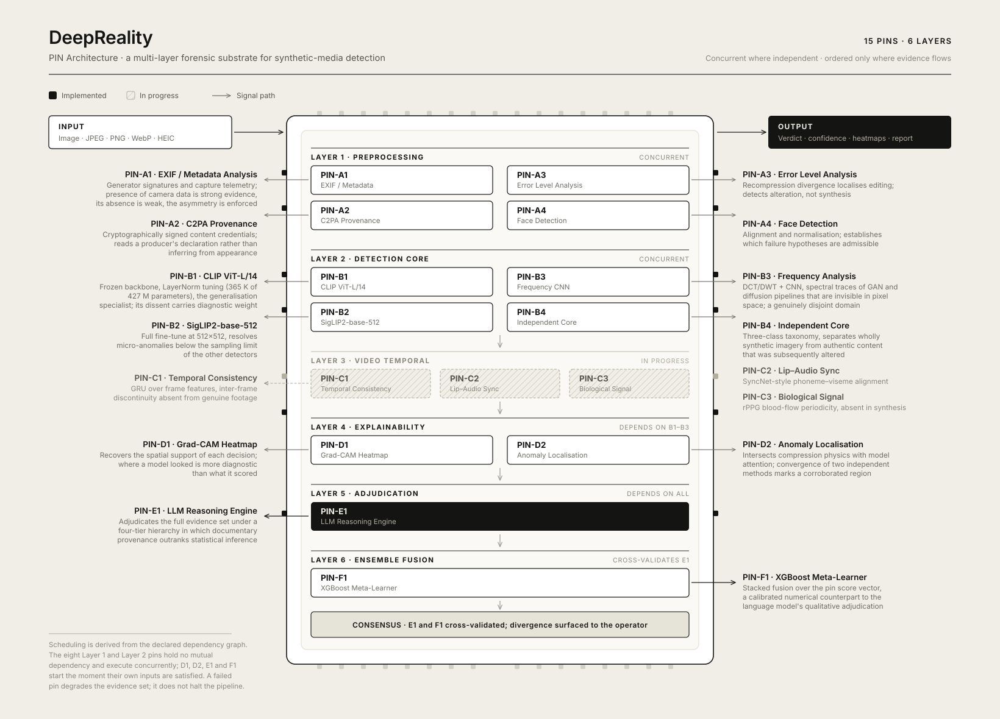

# DeepReality

**A multi-layer forensic architecture for detecting AI-generated and manipulated imagery.**

DeepReality combines several mutually independent analytical paradigms — documentary provenance, compression physics, spatial deep learning, frequency-domain analysis and language-model reasoning — within a single modular pipeline. It is designed to address the central weakness of contemporary detection tools: the *generalisation gap*, whereby systems built on one model architecture recognise only the manipulation techniques present in their training distribution and degrade sharply on unseen generators.



---

## Table of contents

- [1. Problem statement](#1-problem-statement)
- [2. Architectural principles](#2-architectural-principles)
- [3. Layer 1 — Preprocessing](#3-layer-1--preprocessing)
- [4. Layer 2 — Detection Core](#4-layer-2--detection-core)
- [5. Layer 3 — Video Temporal](#5-layer-3--video-temporal-in-progress)
- [6. Layer 4 — Explainability](#6-layer-4--explainability)
- [7. Layer 5 — Adjudication](#7-layer-5--adjudication)
- [8. Layer 6 — Ensemble Fusion](#8-layer-6--ensemble-fusion)
- [9. Execution model](#9-execution-model)
- [10. Installation and use](#10-installation-and-use)
- [11. Known limitations](#11-known-limitations)
- [Author](#author) · [References](#references)

---

## 1. Problem statement

Detection systems that rely on a single learned classifier inherit that classifier's blind spots. A model trained on face-swap deepfakes does not necessarily recognise diffusion-generated imagery; a model trained on the artefacts of one generator may not transfer to the next. Because generative techniques evolve faster than detection corpora can be assembled and labelled, a monolithic detector is structurally destined to lag behind the threat it addresses.

A second, less discussed failure is epistemic rather than statistical. Most systems reduce every available signal to a single scalar and average it. But the evidence types involved are not commensurable. A cryptographically signed C2PA manifest declaring an asset to be `trainedAlgorithmicMedia` is an *assertion by its producer* about how the asset was made. A neural detector's output is an *inference* about how it appears. Averaging the two allows a sufficiently confident inference to overturn a documented fact, which is the wrong result in every case.

DeepReality addresses both. Fifteen independent analysis modules — *pins* — each examine the image from a different epistemic position, and a reasoning stage adjudicates between them under an explicit evidence hierarchy in which documentary provenance constrains statistical inference rather than competing with it.

---

## 2. Architectural principles

### 2.1 The pin abstraction

The organising metaphor is the pin array of a processor: each pin carries one signal, independently, and the substrate integrates them into a single decision. Every pin implements the same contract (`core/base_pin.py`):

```python
def analyze(self, file_path: str) -> dict:
    return {"results": {...}, "score": 0.0, "verdict": "low_risk", "details": "..."}
```

`BasePin.run()` wraps that return value in a uniform envelope, computes the SHA-256 content hash, captures exceptions and persists the result. The uniformity is what allows the adjudication stage to apply one interpretation protocol to fifteen heterogeneous instruments.

| Field | Meaning |
|---|---|
| `pin_id`, `pin_name`, `layer` | Module identity |
| `input_file`, `input_hash` | Analysed file and its SHA-256 digest |
| `status` | `success` or `error` |
| `score` | 0.0 = authentic, 1.0 = certainly synthetic |
| `verdict` | `low_risk` / `medium_risk` / `high_risk` |
| `results` | Pin-specific findings |
| `details` | Human-readable explanation |
| `errors` | Accumulated error strings |

Score semantics are uniform with two declared exceptions: PIN-D1 emits no risk score, and PIN-D2's score expresses localisation-evidence strength rather than a fake probability. Both are honoured by the adjudication stage and neither is averaged with detector probabilities.

### 2.2 Concurrency

Pins are executed by a dependency-graph orchestrator. Pins with no mutual dependency run in parallel; a dependent pin starts the moment its own inputs are satisfied, without waiting for unrelated work. The eight Layer 1 and Layer 2 pins are fully independent and therefore execute concurrently. Measured speed-up on the test corpus is approximately 2×, bounded by contention for the accelerator among the three heavyweight detectors.

### 2.3 Graceful degradation

A pin that fails does not halt the pipeline. Its failure is propagated through the evidence context, the adjudication stage reasons from what remains, and the resulting confidence is reduced in proportion to the evidential weight of what is missing. A partial answer with a stated limitation is more useful than no answer; a forensic system that fails closed is more dangerous than one that fails transparently.

### 2.4 Evidence hierarchy

The four tiers below govern the entire system and are encoded formally in the Layer 5 reasoning protocol.

| Tier | Class | Instruments | Standing |
|---|---|---|---|
| 1 | Decisive provenance | PIN-A2, PIN-A1 signatures | Documentary; near-certain |
| 2 | Capture telemetry | PIN-A1 camera/GPS/timestamp | Strong but rebuttable |
| 3 | Learned detectors | PIN-B1…B4 | Primary statistical evidence |
| 4 | Localisation and attention | PIN-A3, PIN-D1, PIN-D2 | Supporting; never decisive alone |

Two principles are stated explicitly because both are routinely violated in practice:

1. **Provenance dominates statistics.** Higher tiers constrain lower tiers and are not outvoted by them.
2. **Evidence is asymmetric.** The presence of coherent camera telemetry is strong evidence of authentic capture; its absence is weak evidence of anything, because virtually every social platform strips metadata on upload. Failing to encode this asymmetry is the most common error in metadata-based authentication.

---

## 3. Layer 1 — Preprocessing

Lightweight but high-value signals extracted before any model is invoked. These pins read documentary and physical evidence, which is independent of — and in the hierarchy superior to — statistical inference.

### 3.1 PIN-A1 · EXIF / Metadata Analysis

**Purpose.** Extract every metadata layer of the file and evaluate two distinct classes of finding: traces left by generative tools, and telemetry left by a camera.

**Method.** The pin reads standard EXIF (including the GPS and sub-IFD blocks) through Pillow, then scans the raw container for text fragments that Pillow does not surface: PNG `tEXt`/`iTXt` chunks, JPEG `COM`/`APP` segments and embedded XMP. This second pass matters because generators frequently record their parameters there even when the standard EXIF block is empty — a Stable Diffusion `parameters` field, a Midjourney directive string, a DALL-E header.

A separate byte-level scan searches for C2PA/JUMBF markers (`jumb`, `c2pa.actions`, `trainedAlgorithmicMedia`, `c2pa-rs`). These live in the container rather than the EXIF block and therefore frequently survive in files whose metadata otherwise appears stripped. This is a heuristic scan; PIN-A2 performs the authoritative cryptographic parse.

**Scoring.** Deliberately two-tier.

*Tier 1 — evidence floor.* When decisive proof is present, a minimum score is guaranteed and the weighted sum is overridden, because a producer's own declaration cannot be outvoted by an accumulation of weak heuristics:

| Condition | Floor |
|---|---|
| C2PA marker + known AI issuer (OpenAI, Google, Adobe) | 0.85 |
| C2PA marker, issuer unknown | 0.70 |
| Generator signature at ≥ 90 % confidence | 0.75 |
| Generator signature at ≥ 80 % confidence | 0.65 |

*Tier 2 — weighted sum.* Absent decisive evidence, nine signals are combined: generator signature (0.30), C2PA marker (0.25), no camera data (0.12), suspicious software field (0.08), no datetime (0.07), metadata stripped (0.05), generator-typical dimensions (0.05), compression anomaly (0.05), no GPS (0.03). The final score is the greater of the two tiers.

**Interpretation.** Camera telemetry is reported verbatim rather than as a boolean, because its *content* is the evidence: `make: Apple, model: iPhone 12 Pro, lens: 2.71 mm f/2.2, iso: 250` together with GPS coordinates and `DateTimeOriginal` describes a specific physical exposure event that no current generator synthesises coherently. The asymmetry principle applies in full — this is strong evidence for authenticity, while its absence is not evidence of synthesis.

**Output.** `ai_tool_signature`, `camera` (make/model/lens/ISO/aperture), `gps_present`, `capture_datetime_present`, `c2pa_binary_markers`, `metadata_stripped`, `score_breakdown`.

### 3.2 PIN-A2 · C2PA Provenance

**Purpose.** Read and cryptographically verify Content Credentials. This is the most authoritative instrument in the system: every other pin infers provenance from appearance, whereas this one reads a signed assertion by the producing tool.

**Method.** Parsing and validation use the reference `c2pa-python` implementation. Four assertion classes are extracted:

- **`digital_source_type`** (IPTC) — the decisive field. `trainedAlgorithmicMedia` means AI-generated; `algorithmicMedia` means algorithmically produced; `compositeWithTrainedAlgorithmicMedia` means AI-assisted editing.
- **`issuer` / `software_agent`** — the signing organisation and the producing tool.
- **`actions`** — the file's recorded history: `c2pa.created`, `c2pa.generated`, `c2pa.captured`, `c2pa.edited`, `c2pa.drawing`.
- **`validation_status`** — cryptographic integrity of the manifest.

**Manifest chain traversal.** A non-obvious but essential implementation detail. Some providers place the informative claim in a *parent* manifest rather than the active one. OpenAI, for example, emits:

```
Manifest 1 (parent): c2pa.created + GPT-4o + trainedAlgorithmicMedia
Manifest 2 (active): c2pa.opened          ← merely "file was opened"
```

Reading the active manifest alone would miss the decisive evidence entirely. The pin therefore traverses the full chain and enriches fields absent from the active manifest from its parents, annotating each such value with `(from_chain)` so the provenance of the provenance data itself remains auditable.

**Scoring.** Graduated from a base of 0.40 (the presence of C2PA establishes at minimum that a digital tool was involved). Aggravating: `trainedAlgorithmicMedia` +0.35, `compositeWithTrained…` +0.25, known AI issuer +0.15, known AI tool +0.15, generative actions +0.10, valid signature +0.05. Mitigating: camera capture action −0.30, signature validation failure −0.10.

**Interpretation.** Where PIN-A1 reports C2PA markers but PIN-A2 finds no parseable manifest, the container likely holds provenance data the parser could not validate. This is treated as moderate rather than decisive evidence, and the reduced confidence is stated in the report.

### 3.3 PIN-A3 · Error Level Analysis

**Purpose.** Localise regions edited after the file was last saved.

**Theory.** JPEG quantisation is lossy and idempotent at a fixed quality: an already-compressed region re-encoded at the same quality changes very little, whereas freshly inserted content changes substantially. Measuring per-region divergence between the original and a controlled re-encode therefore reveals regions with a different compression history from their surroundings.

**Method.** The image is re-encoded in memory at JPEG Q=90, the absolute per-pixel difference is computed and amplified, and the resulting ELA map is partitioned into an 8×8 grid. Anomalies are detected in both directions using robust statistics:

```
median     = median of the regional means
MAD        = median(|region − median|)
robust_std = MAD × 1.4826

hotspot:   region_mean > median + 3.0 × robust_std
coldspot:  region_mean < median − 3.5 × robust_std
           AND (median − region_mean) ≥ 20 ELA units
```

The Median Absolute Deviation is used rather than the standard deviation because the anomalies themselves would inflate a non-robust dispersion estimate and mask their own detection.

*Hotspots* indicate freshly inserted content not yet compressed. *Coldspots* indicate heavily compressed content pasted from a lower-quality source, which has already lost its detail and so changes little on re-save. The absolute-difference floor on coldspots is necessary: on uniform images the MAD becomes very small, so natural variation (smooth skin, open sky, ≈ 10–15 units below the median) would otherwise cross the sigma threshold, whereas genuine manipulation produces a gap of 40 units or more.

**Interpretation constraints.** These are enforced in the scoring rather than left to the reader:

- ELA presupposes a *lossy* compression history. On PNG, lossless WebP and format-converted sources the premise is weakened. The pin classifies its input by compression class and reports the reliability.
- Global uniformity is capped as a weak supporting signal (maximum 0.25) and is never decisive alone. Its discriminative power has collapsed in both directions: smartphone computational photography makes authentic photographs uniform, while modern generators synthesise realistic texture with natural variation.
- Anomaly detection carries the strong signal (maximum 0.85) and is format-independent.
- **ELA localises editing, not synthesis.** A wholly generated image is internally consistent and typically produces no anomalies. Absence of ELA findings is therefore not evidence of authenticity.

### 3.4 PIN-A4 · Face Detection and Cropping

**Purpose.** Detect, align and normalise faces, and establish which failure hypotheses are admissible.

**Method.** MediaPipe BlazeFace, supporting both the modern Tasks API and the legacy Solutions API with automatic selection. For each detection the pin extracts a bounding box with confidence, six landmarks (eyes, nose tip, mouth centre, ears), alignment data derived from the eye axis (roll angle, inter-eye distance, frontal/profile classification) and quality metrics (Laplacian sharpness, brightness, contrast, area ratio, resolution class). Faces are rotated onto the eye axis, cropped with a 30 % margin and normalised to 224×224.

**Role.** This pin emits no authenticity score. Its contribution is *hypothesis admissibility*: face swap and reenactment deepfakes require a face, whereas a fully synthetic scene need not contain one. It additionally supplies normalised crops for downstream analysis and a quality assessment that bounds how much weight the detector outputs deserve — a heavily blurred or extremely small face limits what any classifier can legitimately conclude.

---

## 4. Layer 2 — Detection Core

Four detectors spanning deliberately different paradigms, selected so that the blind spot of any one architecture is covered by another. Their disagreement is surfaced to the adjudication stage rather than averaged away.

### 4.1 PIN-B1 · CLIP ViT-L/14 (frozen backbone, LayerNorm tuning)

**Architecture.** OpenAI CLIP ViT-L/14 with the vision backbone frozen; only the LayerNorm affine parameters are trained, together with a small classification head — approximately **365 K trainable parameters of 427 M total (0.09 %)**.

**Rationale.** The pretrained CLIP representation encodes broad visual semantics learned from a very large and diverse corpus. Full fine-tuning on a comparatively small deepfake dataset overwrites that representation with corpus-specific artefact detection, which raises in-distribution accuracy while destroying transfer. Restricting adaptation to LayerNorm statistics recalibrates the feature distribution without altering the learned features themselves. The consequence is that this detector degrades most gracefully on generators absent from training, which makes it the system's generalisation specialist — and makes its dissent from the fine-tuned detectors diagnostically informative rather than a minority vote to be outweighed.

**Input/output.** 224×224; emits `clip_prob`, `clip_confidence` and a 1024-dimensional feature vector.

**Measured performance.** Test accuracy 99.77 %, F1 99.77 %, ROC-AUC 0.9997 (OpenDeepfake-Preview, held out).

### 4.2 PIN-B2 · SigLIP2-base-512 (full fine-tune)

**Architecture.** Google SigLIP2-base-patch16-512 with the full vision encoder fine-tuned — **93.7 M trainable of 376 M total**.

**Rationale.** SigLIP replaces CLIP's softmax contrastive objective with a pairwise sigmoid loss, which decouples the loss from the batch-global normalisation term and yields stronger representations at equivalent scale. More importantly here, this pin operates at **512×512, the highest input resolution in the system**: generative artefacts at the scale of individual hair strands, iris texture, tooth boundaries and skin pores are simply below the sampling limit of a 224×224 model. Full fine-tuning maximises in-distribution accuracy at a cost — it is the detector most sensitive to distribution shift, which is precisely why it is paired with B1 rather than deployed alone.

**Input/output.** 512×512; emits `siglip_prob`, `siglip_confidence` and a 768-dimensional feature vector.

**Measured performance.** Test accuracy 99.97 %, F1 99.97 %, ROC-AUC 1.0000 (OpenDeepfake-Preview, held out).

### 4.3 PIN-B3 · Frequency Analysis (DCT/DWT + CNN)

**Architecture.** A purpose-built five-block convolutional network (≈ 4.8 M parameters) trained from scratch on a four-channel frequency representation.

**Theory.** Generative pipelines leave systematic traces in the frequency domain that are invisible in pixel space. GAN decoders built from transposed convolutions or nearest-neighbour upsampling produce periodic spectral peaks — the characteristic checkerboard signature. Diffusion samplers, operating in a latent space and decoded through a VAE, impose their own spectral fingerprint on the high-frequency band. Neither artefact class is reliably recoverable by a spatial classifier, which is trained to be approximately invariant to exactly this kind of global statistical structure.

**Representation.** The image is converted to grayscale, resized to 224×224 and transformed into four channels:

| Channel | Content |
|---|---|
| 0 | DCT log-magnitude spectrum (global frequency structure) |
| 1 | DWT LH subband — horizontal detail / vertical edges |
| 2 | DWT HL subband — vertical detail / horizontal edges |
| 3 | DWT HH subband — diagonal detail, corner and texture artefacts |

The Haar wavelet is used for its compact support, which preserves partial spatial localisation in the detail subbands — the property PIN-D1 relies on when producing an approximate spatial attribution for this model.

**Why it matters for fusion.** B3's domain is *disjoint* from that of B1 and B2. Agreement between a spatial detector and a frequency detector therefore constitutes genuine corroboration rather than a repeated measurement of the same quantity — a stronger form of evidence than agreement among spatial models alone.

**Sensitivity.** Resampling, aggressive denoising and heavy recompression all perturb the spectrum without implying synthesis. The adjudication protocol accounts for this.

**Measured performance.** Test accuracy 96.50 %, F1 96.58 %, ROC-AUC 0.9923.

### 4.4 PIN-B4 · Independent Core (three-class)

**Architecture.** SigLIP2-base-patch16-224 with a three-way classification head (`prithivMLmods/AI-vs-Deepfake-vs-Real-Siglip2`, Apache 2.0), run entirely locally.

**Rationale.** The only multi-class detector in the system, and the only instrument able to express the distinction the binary detectors structurally cannot: **whether an image was synthesised outright or is authentic content that was subsequently altered.** That distinction is not cosmetic — it determines which downstream evidence is meaningful. For a wholly synthetic image, ELA has nothing to localise; for a manipulated authentic image, ELA and Grad-CAM fusion become the primary localisation instruments. It was trained independently of B1–B3 and therefore constitutes a genuinely separate vote rather than a fourth reading of the same corpus.

**Output.** `p_ai_generated`, `p_deepfake`, `p_real`, `predicted_class`, and an ensemble-compatible `fake_score = p_ai + p_deepfake`.

**Measured performance.** 99.05 % on its 4,000-image evaluation set.

### 4.5 Correlated consensus — a caveat

PIN-B1, B2 and B3 were trained on the same corpus (OpenDeepfake-Preview, ≈ 20 K images). Their agreement is therefore **partially correlated through a shared data distribution and does not constitute three independent confirmations.** The adjudication protocol encodes this explicitly by capping confidence derived from detector consensus alone at approximately 0.90 in the absence of provenance evidence. Stating this is a matter of methodological honesty: an ensemble that presents correlated votes as independent systematically overstates its own certainty.

---

## 5. Layer 3 — Video Temporal *(in progress)*

Video introduces an evidence dimension unavailable in still images: consistency across time. The three pins below are specified in the architecture and are not part of the present implementation.

### 5.1 PIN-C1 · Temporal Consistency

Frame-level features extracted by the Layer 2 backbones are passed to a recurrent model (GRU or LSTM) that scores inter-frame continuity. Genuine footage exhibits smooth feature trajectories governed by physical motion; frame-by-frame synthesis, which lacks an explicit temporal prior, produces discontinuities at boundaries where the generator's identity reconstruction shifts. Intended output: `temporal_score`, `inconsistent_frames[]`.

### 5.2 PIN-C2 · Lip–Audio Synchronisation

A SyncNet-style two-stream encoder embeds mouth-region crops and the corresponding audio spectrogram into a shared space, where correlation is measured over a sliding window. Phoneme–viseme misalignment is among the most persistent artefacts in reenactment and dubbing pipelines, because it requires the generator to model a cross-modal constraint rather than a single distribution. Intended output: `sync_score`, `desync_timestamps[]`.

### 5.3 PIN-C3 · Biological Signal

Remote photoplethysmography recovers the periodic colour fluctuation caused by cardiac blood flow in facial skin. The signal is spatially coherent across facial regions and temporally periodic within the plausible heart-rate band. Synthetic faces have no cardiovascular system, and current generators do not model this signal, so its absence or incoherence is evidence of synthesis independent of any visual artefact. Intended output: `bio_score`, `ppg_signal`.

**Note on evidential standing.** These pins would occupy Tier 3 alongside the Layer 2 detectors, with C3 arguably closer to Tier 2 — it measures a physical process rather than a learned appearance statistic.

---

## 6. Layer 4 — Explainability

Commercial detection tools are predominantly opaque: a score is returned with no account of its basis. Layer 4 converts model output into inspectable evidence, which serves two purposes — operator trust, and false-positive diagnosis.

### 6.1 PIN-D1 · Grad-CAM Heatmap

**Method.** Grad-CAM (Selvaraju et al., 2017) recovers the spatial support of a decision by differentiating the target-class logit with respect to a chosen layer's activations, using the channel-mean gradients as importance weights and rectifying the weighted sum to retain only evidence *supporting* the class.

**Adaptation to Vision Transformers.** The target layer is the `layer_norm1` module of the final encoder block. Token activations are reshaped onto the patch grid — 16×16 for B1 at 224 px, 32×32 for B2 at 512 px — with automatic CLS-token handling: if the token count is a perfect square the sequence has no CLS (SigLIP); if `count − 1` is a perfect square the leading token is discarded (CLIP).

**Implementation.** No external XAI package is used, which keeps the pin compatible with current `transformers` releases. Gradients are obtained through `torch.autograd.grad(logit, activation)` rather than a full `backward()` pass, so back-propagation terminates at the target layer. Since that layer is the final encoder block, this is roughly **twenty times cheaper** than differentiating the entire 24-block ViT, and it never touches parameter `.grad` fields.

**Frequency-model caveat.** The PIN-B3 map is derived from a DCT/DWT representation whose correspondence to image coordinates is only approximate — the wavelet subbands retain partial spatial structure, the DCT channel none. It is therefore weighted at 20 % in the combined map against 40 % each for the spatial models.

**Cross-model agreement.** The IoU between the thresholded CLIP and SigLIP maps is reported. High agreement indicates a shared, reproducible cue; near-zero agreement indicates the detectors fired for unrelated reasons, and their numerical consensus is correspondingly weaker than it appears.

**Diagnostic value.** *Where* a model looked is frequently more informative than *what* it scored. Attention concentrated on flat background regions while the detectors report high fake probability is the signature of distribution shift rather than genuine detection.

### 6.2 PIN-D2 · Anomaly Localisation

**Method.** Two independent evidence classes are intersected: the ELA anomaly regions of PIN-A3, grounded in compression physics, and the combined Grad-CAM map of PIN-D1, grounded in learned representations. Adjacent ELA grid cells are merged first, since a manipulation larger than one cell necessarily spans several and reporting them separately would overstate the number of distinct findings. The mean CAM activation inside each merged region is then measured; regions above threshold are marked **fused**.

**Rationale.** Two methods with disjoint failure modes converging on the same coordinates is substantially stronger evidence than either alone, and it is the only signal in the system that answers *where* rather than *whether*.

**An important gate.** Because the CAM is normalised, *every* image has a hottest region. When no detector reports synthesis, those regions indicate only where the model looked — not that anything is anomalous. CAM-only regions are therefore marked only when at least one Layer 2 model exceeds the medium-risk threshold. Without this gate the pin annotates clean images with meaningless boxes, which is worse than silence because it manufactures the appearance of evidence.

**Scoring.** The score expresses **localisation-evidence strength, not fake probability**: fused region 0.80, high-severity ELA only 0.55, low/moderate ELA only 0.35, concentrated CAM only 0.30, none 0.05. It is consumed as a distinct feature by the adjudication and ensemble stages and never averaged with detector probabilities.

**Output.** Annotated overlay with colour-coded regions — red for ELA hotspot, blue for coldspot, yellow for Grad-CAM focus, heavy orange for corroborated fusion.

---

## 7. Layer 5 — Adjudication

### 7.1 PIN-E1 · LLM Reasoning Engine

The terminal node of the dependency graph, and the only component that observes all upstream evidence simultaneously. It is therefore the only component able to weigh documentary provenance against statistical inference, recognise when an instrument is operating outside its validated domain, and state a conclusion with its residual uncertainty.

**Evidence compression.** Unabridged pin output for a single image exceeds 2,300 embedding values (CLIP 1024-d, SigLIP2 768-d, frequency CNN 512-d) alongside static model cards, per-region pixel ranges and facial landmark coordinates — approaching 17,000 tokens, of which essentially none carries adjudication value. An embedding is meaningful to a downstream classifier, not to a reasoning model. Three reductions are applied:

1. **Elimination** — embeddings, model cards, raw manifests and landmark coordinates are dropped entirely. Static model characteristics are described once in the system prompt instead of being repeated per request.
2. **Aggregation** — region lists are summarised by count, severity distribution and strongest representatives rather than enumerated exhaustively.
3. **Normalisation** — every pin is reduced to the same shape, so a uniform interpretation protocol applies.

Measured across the test corpus this yields a **96–97 % token reduction, approximately 17,000 tokens to 620**, with no loss of decision-relevant information. Derived consensus statistics (mean, min, max, spread, count flagging fake) are computed in code rather than delegated to the model, which removes an arithmetic failure mode and makes disagreement immediately visible.

**Reasoning protocol.** The system prompt (≈ 3,900 tokens) is not a general instruction to analyse data. It specifies:

- an **instrument reference** — the physical or statistical basis of every pin and its reliability characteristics;
- the **four-tier evidence hierarchy** of §2.4, with the asymmetry principle stated as a mandatory constraint;
- **documented failure modes** — the computational-photography false positive, format-induced ELA artefacts, correlated consensus, and missing-pin degradation;
- a **deterministic conflict-resolution procedure** (R1–R6) applied in order, with the applied rule reported in the output;
- a **five-value verdict taxonomy** — `AUTHENTIC`, `AI_GENERATED`, `DEEPFAKE`, `SUSPICIOUS`, `INCONCLUSIVE` — with consistency constraints binding verdict, probability and confidence, and confidence treated as a quantity distinct from fake probability.

**Response handling.** Model output is validated and repaired where recoverable — verdict synonyms are mapped, out-of-range probabilities clamped, and each repair recorded — rather than discarding an otherwise sound adjudication over a formatting deviation. JSON is recovered from fenced, array-wrapped or prose-wrapped responses.

**Degradation.** Where no credential is configured or the provider is unreachable, a deterministic rule-based adjudication implementing the same hierarchy is returned, explicitly labelled through `reasoning_mode`. The system remains functional offline, at the cost of the narrative justification and nuanced conflict handling that motivate the stage.

**Auditability.** The exact prompt payload and raw response are persisted per image. A forensic conclusion that cannot be traced back to the evidence and instructions that produced it has no evidentiary standing.

**Output.** `final_verdict`, `fake_probability`, `confidence`, `applied_rule`, `decisive_evidence[]`, `contradicting_evidence[]`, `failure_mode_flags[]`, `manipulation_regions`, `report`, `recommendation`.

### 7.2 The decision calculus (R1–R6)

Conflict between instruments is not resolved by averaging. Averaging presumes the inputs are commensurable measurements of one quantity, which they are not: a cryptographic assertion and a neural activation are different kinds of claim about the world. The system instead applies six **ordered rules**, evaluated top to bottom, terminating at the first whose precondition holds. Every adjudication reports which rule fired, which makes the reasoning reproducible and contestable after the fact.

The ordering implements **lexicographic priority over the evidence tiers of §2.4**: no accumulation of lower-tier evidence, however large, can outweigh a higher tier. This is the formal expression of *provenance dominates statistics*.

Let the predicates be:

| Symbol | Meaning |
|---|---|
| `P_ai` | Tier 1 AI provenance — valid C2PA manifest with an AI `digital_source_type`, a known AI issuer/software agent, an explicit generator signature, or an unvalidated IPTC source-type marker |
| `P_cap` | Tier 1 authentic-capture provenance — signed camera-capture manifest with no AI action and no edit history |
| `T_cam` | Tier 2 capture telemetry — coherent camera EXIF, ideally with GPS and `DateTimeOriginal` |
| `μ` | Mean fake probability across the available Layer 2 detectors |
| `σ_spread` | `max − min` of those probabilities |
| `F` | Count of corroborated (fused) regions reported by PIN-D2 |
| `A_subj` | Grad-CAM attention concentrated on the semantic subject rather than on background |

| Rule | Precondition | Outcome |
|---|---|---|
| **R1** | `P_ai` | Verdict taken **from the declared source type**: `trainedAlgorithmicMedia`/`algorithmicMedia` → `AI_GENERATED`; `compositeWithTrainedAlgorithmicMedia` → `DEEPFAKE`. Confidence 0.93–0.98, reduced to 0.85–0.90 when the signature could not be validated. Detector dissent raises no objection to the verdict — it only indicates the generator is visually convincing, which is stated. PIN-B4's class opinion does **not** override the declaration. |
| **R2** | `P_cap ∧ ¬P_ai` | `AUTHENTIC`, confidence 0.85–0.93. |
| **R3** | `T_cam ∧ μ ≥ 0.5` | The conflict case. If `F = 0 ∧ ¬A_subj`, the computational-photography failure mode is diagnosed: Tier 2 prevails, verdict `AUTHENTIC` or `SUSPICIOUS`, and the suspected false positive is named explicitly. If `F > 0 ∧ A_subj`, the manipulation hypothesis survives: `DEEPFAKE` at moderate confidence. |
| **R4** | `¬P_ai ∧ ¬P_cap ∧ ¬T_cam ∧ σ_spread ≤ 0.40` | Decide on Tier 3 consensus, qualified by Tier 4. **Only here** — where no source type was declared — does PIN-B4's class distribution choose between `AI_GENERATED` and `DEEPFAKE`. |
| **R5** | `σ_spread > 0.40 ∧ ¬P_ai ∧ ¬P_cap` | `SUSPICIOUS`, confidence ≤ 0.60, with the disagreeing detectors named. Wide dispersion means at least one instrument is outside its validated domain; the system reports that rather than concealing it behind an average. |
| **R6** | Evidence insufficient or irreconcilable | `INCONCLUSIVE`. Selecting this honestly is correct behaviour, not failure. |

**Worked example — R1.** A Gemini-produced image carried the marker `trainedAlgorithmicMedia` with issuer hint `google_ai`, but the reference parser could not validate the manifest. Detector output was mixed: PIN-B4 reported `Deepfake` at 0.998, while PIN-B1 and PIN-B2 reported 0.416 and 0.056 — near-`REAL`. R1 fired on the unvalidated source-type marker, returning `AI_GENERATED` at confidence 0.88: the producer's declaration set both the verdict and the taxonomy, overriding B4's contrary class opinion, and the reduced confidence recorded the unvalidated signature. Averaging the four detectors would have produced a materially worse answer.

**Worked example — R3.** An authentic iPhone 12 Pro photograph carrying full telemetry (lens 2.71 mm f/2.2, ISO 250, GPS, `DateTimeOriginal`) was flagged by three of four detectors at 0.96–0.98. PIN-D2 reported `F = 0`, and PIN-D1 showed attention on flat wall regions rather than the face. R3 diagnosed the computational-photography failure mode and returned `AUTHENTIC` at 0.85, naming the conflict in the report. A single-model system would have declared this image a deepfake.

**Why ordering rather than weighting.** A weighted scheme has no way to express "this evidence class cannot be outvoted." Any finite weight on documentary provenance can be overcome by enough correlated detector agreement — and because PIN-B1 through B3 share a training corpus (§4.5), such agreement is precisely what the system produces most readily under distribution shift. Ordered rules make the constraint structural rather than parametric.

---

## 8. Layer 6 — Ensemble Fusion

### 8.1 PIN-F1 · XGBoost Meta-Learner

**Purpose.** A calibrated numerical counterpart to the language model's qualitative adjudication, and a cross-check against it.

**Method.** Stacked generalisation over the pin score vector. The base learners are the pins themselves; the meta-learner is a gradient-boosted tree ensemble trained on their outputs against ground-truth labels. Feature inputs comprise the Layer 2 probabilities and confidences, the Layer 1 provenance signals as categorical indicators, the ELA anomaly statistics, the PIN-D1 cross-model agreement IoU and the PIN-D2 localisation-evidence score.

**Rationale for trees over a linear blend.** The optimal combination is not linear. The value of a detector's output is *conditional* on the evidence around it — a high B2 score means something different when camera telemetry is present than when it is absent, and B1's dissent matters more when the subject resembles a photograph than when it does not. Gradient-boosted trees represent such interactions natively, whereas a fixed weighted average cannot express them at all.

**Cross-validation against Layer 5.** The two stages are deliberately redundant and derived differently: E1 reasons symbolically over an evidence hierarchy, F1 fits statistically to labelled outcomes. Agreement raises confidence in the result. **Divergence is surfaced to the operator rather than silently resolved**, because a disagreement between a symbolic and a statistical adjudicator of the same evidence is itself a meaningful finding — it marks the cases most deserving of human review.

**Calibration.** Platt scaling maps raw ensemble output onto calibrated probabilities, so that a reported 0.80 corresponds to an empirical 80 % frequency. This matters for any operational deployment where a threshold carries consequences.

---

## 9. Execution model

### 9.1 Dependency graph

```
PIN-A1  PIN-A2  PIN-A3  PIN-A4  PIN-B1  PIN-B2  PIN-B3  PIN-B4     (concurrent)
                                   │       │       │
                                   └───────┼───────┘
                                           ▼
                                        PIN-D1
                                           │
                    PIN-A3, PIN-B3 ────────┤
                                           ▼
                                        PIN-D2
                                           │
                            all upstream ──┤
                                           ▼
                                        PIN-E1  ──►  PIN-F1  ──►  consensus
```

`PinPipeline._validate()` rejects missing dependencies and cycles before execution. The scheduler dispatches every pin whose dependencies are satisfied and blocks on `FIRST_COMPLETED`, so a newly unblocked pin starts without waiting for unrelated work.

### 9.2 Threads rather than processes

PyTorch inference, NumPy/OpenCV kernels and file I/O all release the GIL, so threads achieve genuine parallelism on this workload. More importantly, the loaded models — several gigabytes in aggregate — are shared from memory rather than duplicated per process.

### 9.3 Context propagation

Dependent pins receive both upstream envelopes and live object references:

```python
{
    "PIN-B1": {...complete envelope...},
    "_pins":  {"PIN-B1": <PinB1Clip instance>}
}
```

The `_pins` channel is how PIN-D2 obtains PIN-D1's raw NumPy activation maps without serialising them through JSON, and how PIN-D1 reuses the already-loaded detector models rather than allocating its own — the reason the explainability layer adds no memory cost.

### 9.4 A thread-safety note

`transformers` resolves submodules lazily, and that first resolution is not thread-safe: two pins importing simultaneously can observe a partially initialised module and raise a spurious `ImportError`. This was observed in practice. Every required symbol is therefore resolved on the main thread before the concurrent stage begins, reducing later imports to a dictionary lookup.

---

## 10. Installation and use

### 10.1 Installation

```bash
git clone https://github.com/<user>/DeepReality.git
cd DeepReality

python3 -m venv venv
source venv/bin/activate        # Windows: venv\Scripts\activate
pip install -r Requirements.txt
```

Trained weights (~3.4 GB) are distributed separately; see [models/README.md](models/README.md).

### 10.2 Configuration

```bash
cp .env.example .env
```

```
OPENROUTER_API_KEY=sk-or-v1-...
DEEPREALITY_LLM_MODEL=google/gemma-4-26b-a4b-it:free
```

The reasoning model is selected entirely from `.env` — any identifier from `openrouter.ai/models` works without a source change, and any OpenAI-compatible endpoint may be substituted through `DEEPREALITY_LLM_API_BASE`. Remaining defaults live in `config/settings.py` under `LLM_CONFIG`. Layers 1, 2 and 4 operate offline and require no credential.

Note that the reasoning protocol is demanding — strict JSON output and multi-step evidence weighting. Free-tier models produce usable but shallower adjudications; a frontier model is recommended for production analysis.

### 10.3 Running

```bash
# Place images in input/ — jpg, png, webp, bmp, tiff, gif, heic/heif
python3 main.py
```

Progress is reported per pin as it completes, followed by layer summaries and the adjudicated verdict. The compute device is selected automatically (CUDA → Apple MPS → CPU).

### 10.4 Outputs

| Artefact | Contents |
|---|---|
| `{image}_PIN-XX.json` | Standard envelope per pin — score, verdict, detailed findings |
| `{image}_PIN-E1.json` | Final verdict, confidence, decisive evidence, narrative report |
| `{image}_PIN-E1_transcript.json` | Exact prompt payload and raw response, for audit |
| `{image}_ELA_heatmap.png` | Error Level Analysis heatmap |
| `{image}_face_N.png` | Detected and normalised face crops |
| `{image}_XAI_D1_{model}.png` | Grad-CAM overlays (clip, siglip, freq, combined) |
| `{image}_XAI_D2_anomaly.png` | Annotated anomaly map with fused regions marked |

### 10.5 Project structure

```
DeepReality/
├── main.py                      # Entry point and pipeline construction
├── config/settings.py           # All thresholds, weights and paths
├── core/
│   ├── base_pin.py              # Standard pin contract (BasePin)
│   └── pipeline.py              # Dependency-graph parallel orchestrator
├── layer1_preprocessing/        # PIN-A1 … PIN-A4
├── layer2_detection_core/       # PIN-B1 … PIN-B4
├── layer3_video_temporal/       # PIN-C1 … PIN-C3 (in progress)
├── layer4_xai/                  # PIN-D1, PIN-D2
├── layer5_llm_reasoning/
│   ├── evidence_builder.py      # Token-efficient evidence digest
│   ├── prompts.py               # Forensic reasoning protocol
│   ├── llm_client.py            # Provider client
│   └── pin_e1_llm.py            # PIN-E1
├── layer6_ensemble/             # PIN-F1
├── models/                      # Trained weights — see models/README.md
├── input/                       # Images to analyse
└── outputs/                     # Analysis results
```

No decision constant is hard-coded inside a pin: thresholds, weights, model paths and prompt configuration are centralised in `config/settings.py`. A detailed internal reference is available in [PROJECT_STRUCTURE.md](PROJECT_STRUCTURE.md).

---

## 11. Known limitations

Stated explicitly, since a detection system whose failure modes are undocumented cannot be meaningfully evaluated.

**Computational-photography false positives.** Modern smartphones apply multi-frame fusion, aggressive denoising, skin smoothing and sharpening. The resulting low-noise, locally smooth texture resembles the statistical signature of generative output, and the fine-tuned detectors over-report on authentic phone photographs as a result. This was observed directly during development: on an authentic iPhone 12 Pro photograph carrying full camera telemetry and GPS, all four Layer 2 detectors returned high fake probabilities, while Grad-CAM showed their attention concentrated on flat wall regions rather than on the subject's face. Layer 5 recognises this signature and downgrades the verdict accordingly, but the underlying detector bias remains and is best addressed by extending the training distribution.

**Correlated consensus.** PIN-B1 through B3 share a training corpus; their agreement does not constitute independent confirmation, and confidence derived from consensus alone is capped accordingly.

**ELA scope.** Error Level Analysis presupposes a lossy compression history and localises editing rather than synthesis. On lossless or converted sources its findings are supporting evidence only.

**Metadata is forgeable.** Capture telemetry is strong but rebuttable evidence. A determined adversary can fabricate EXIF fields — which is precisely why the architecture does not rest on any single evidence class.

**Frequency-domain explainability.** The PIN-B3 Grad-CAM map corresponds only approximately to image coordinates and is down-weighted in the combined attention map for that reason.

**Free-tier reasoning models.** Smaller models occasionally emit malformed JSON or shallower justifications. PIN-E1 repairs what it can and records each repair, but adjudication quality is bounded by the configured model.

---

## Author

**Ömer Faruk Kurtuluş**

## References

1. Radford, A. et al. (2021). *Learning Transferable Visual Models From Natural Language Supervision.* ICML 2021. [arXiv:2103.00020](https://arxiv.org/abs/2103.00020)
2. Zhai, X. et al. (2023). *Sigmoid Loss for Language Image Pre-Training.* ICCV 2023. [arXiv:2303.15343](https://arxiv.org/abs/2303.15343)
3. Selvaraju, R. R. et al. (2017). *Grad-CAM: Visual Explanations from Deep Networks via Gradient-based Localization.* ICCV 2017. [arXiv:1610.02391](https://arxiv.org/abs/1610.02391)
4. Rössler, A. et al. (2019). *FaceForensics++: Learning to Detect Manipulated Facial Images.* ICCV 2019. [arXiv:1901.08971](https://arxiv.org/abs/1901.08971)
5. Yan, Z. et al. (2024). *DF40: Toward Next-Generation Deepfake Detection.* [arXiv:2406.13156](https://arxiv.org/abs/2406.13156)
6. Chung, J. S. & Zisserman, A. (2016). *Out of Time: Automated Lip Sync in the Wild.* ACCV 2016 Workshops.
7. Chen, T. & Guestrin, C. (2016). *XGBoost: A Scalable Tree Boosting System.* KDD 2016. [arXiv:1603.02754](https://arxiv.org/abs/1603.02754)
8. Coalition for Content Provenance and Authenticity (2024). *C2PA Technical Specification.* [c2pa.org](https://c2pa.org)
